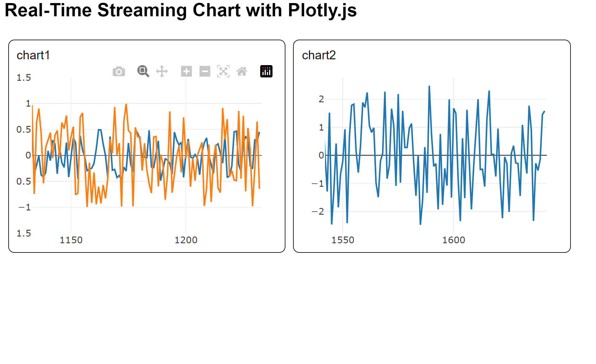

# Streaming / Scrolling Charts Demo

Quick repo for wrapping plotly.js into simple streaming and scrolling charts.




## Usage
See basic.html for a simple example or index.html for 2 charts running with different update rates inside some boxes (shown above)

BSD-2 license (see LICENSE.TXT)

If python3 is installed one can run a local webserver via:
```bash
python3 -m http.server 8000 
```
Then open a browser window at localhost:8000

Otherwise this should also work as a file:// url

### Example code snippet
```html
<html>
<head>
<meta http-equiv="content-type" content="text/html; charset=UTF-8" />
<script src="./js/plotly.min.js"></script>
<script src="./js/bitwrench.min.js" ></script>
<script src="./js/chart-helpers.js"> </script>
</head>
<body class="bw-def-page-setup bw-font-sans-serif">
<h2 >Real-Time Chart with Plotly.js</div>
<div id="chart"></div>
<script>
    // sample simulated data
    function getData() {
        return Math.random()-0.5;
    }  

    // make a new chart
    newPlotlyLineChart(
        "chart", // dom id of chart
         2,      // number of traces (can be 1 to any)
        {yaxis:{range:[-1,1]}} // optional layout (see plotlyjs docs)
        );
    
    // set interval updates the chart by calling getData() every
    setInterval(
        function(){
            updatePlotlyLineChart("chart",[getData(),getData()]); // update chart
        },
        25 // every 25 milliseconds this is called
    );

</script>
</body>
</html>
```

